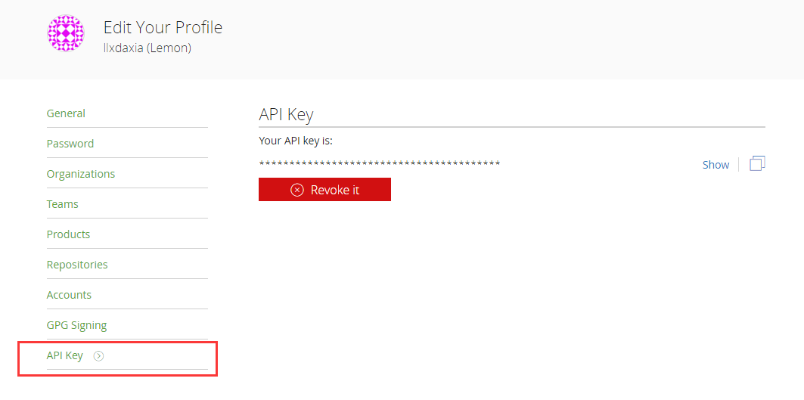
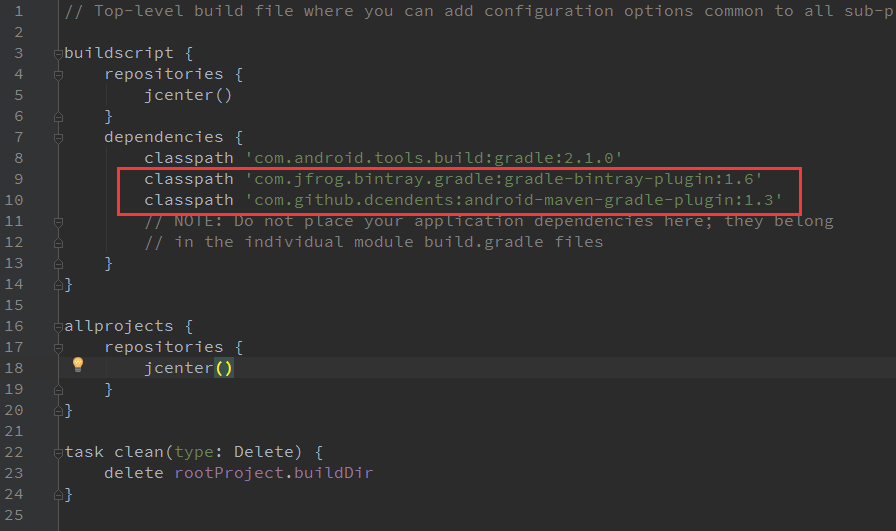
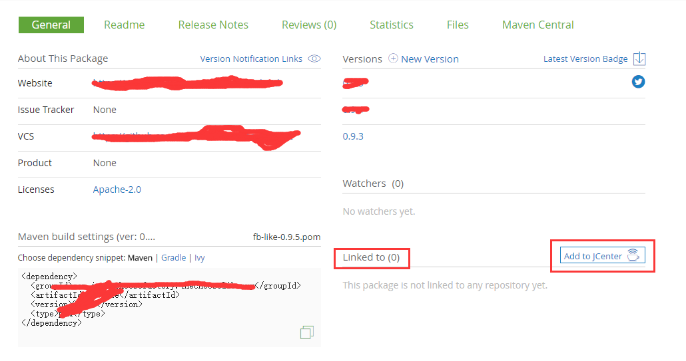

# Android库上传到jcenter

### 第一步
>[注册bintray账号](https://bintray.com/)，建议使用github账号直接登录。
登录账号以后，记录下自己的API Key。

登录账号以后，点击右上角头像打开自己的主页，然后看到左上角的地方有个Edit按钮


找到左下角的API Key选项，记录下来


**注意**：如果网站打不开或者很慢，建议[翻墙](http://gjsq.me/11664436)（使用过的最好用最快的VPN）。

### 第二步

在Android studio中新建一个`project`（项目）目录下有一些`build.gradle`文件，分为两种：一种是`project`级别的gradle文件（全局设置）。一种是每个`module`对应一个gradle文件，设置是局部的。

**然后新建一个`module`，用于编写自己的库，用于上传到bintray**。
**注意**：`只有module才能上传到jcenter`。


### 第三步

打开项目project的`build.gradle`文件，添加两个插件（目前是最新版本，如果后期需要更新，可以到`bintray`上面去搜）

```java
   classpath 'com.jfrog.bintray.gradle:gradle-bintray-plugin:1.6'
   classpath 'com.github.dcendents:android-maven-gradle-plugin:1.3'
```

如图



也可以看这里的[build.gradle文件](https://github.com/llxdaxia/RestHttp/blob/dev/build.gradle)

**重点来了**

打开要上传到`jcenter`的`module`（你写的库）的`build.gradle`文件。

在`module`下的`build.gradle`文件的`根目录`添加下面内容

```java
ext {
    bintrayRepo = 'maven'     //bintray上的仓库名，一般为maven
    bintrayName = 'RestHttp'   //bintray上的项目名

    publishedGroupId = 'cn.alien95'    //jcenter的GroupId：一般是包名
    artifact = 'resthttp'     //jcenter的ArtifactId：一般是项目名
    libraryVersion = '1.0.1-beta1'    //发布的版本号：每次上传必须不一样

    siteUrl = 'https://github.com/llxdaxia/RestHttp'       //网站地址
    gitUrl = 'https://github.com/llxdaxia/RestHttp.git'    //git地址

    libraryName = 'RestHttp'       //项目名字
    libraryDescription = 'A network framework for Android'     //项目描述

    //开发者信息
    developerId = 'Lemon'
    developerName = 'Lemon'
    developerEmail = 'daxiallx@gmail.com'

    //以上所有信息自行修改，以下不变
    licenseName = 'The Apache Software License, Version 2.0'
    licenseUrl = 'http://www.apache.org/licenses/LICENSE-2.0.txt'
    allLicenses = ["Apache-2.0"]
}
apply from: 'https://raw.githubusercontent.com/llxdaxia/GradleScript/master/install_v1.gradle'
apply from: 'https://raw.githubusercontent.com/llxdaxia/GradleScript/master/bintray_v1.gradle'

//或者以下版本
//apply from: 'https://raw.githubusercontent.com/llxdaxia/GradleScript/master/install.gradle'
//apply from: 'https://raw.githubusercontent.com/llxdaxia/GradleScript/master/bintray.gradle'
```

最后打开`local.properties`文件，添加下面内容

```java
bintray.apikey=刚才记录的API Key
bintray.user=用户名
```

### 第四步

在Android studio左下角点开`Terminal`


输入命令`gradlew bintrayupload`，坐等上传成功，如图


### 第五步

再一次打开`bintary`官网，登录账号，在左下角的地方可以看到


点击进入后，在右下角可以看到



`linked to (0)`说明还没有链接任何其他的仓库，然后点击`add to JCenter` 连接到jcenter。


随便写点什么，然后提交坐等JCenter工作人员审核，一般一天就好了。

终于搞完了。。。。你可以愉快的通过`gradle`依赖了。

```java
compile 'cn.alien95:resthttp:1.0.1-beta1'
```

[你如果还有疑问，看看这篇优秀的博客](http://www.devtf.cn/?p=760)


